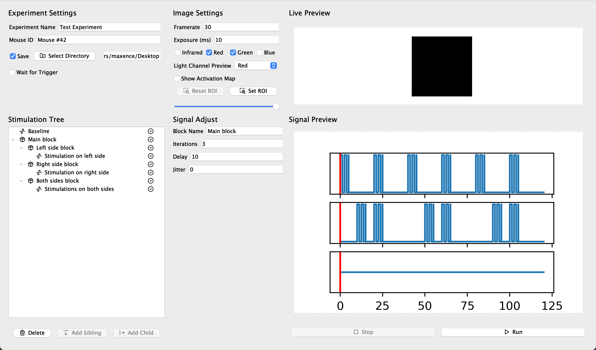

<!-- PROJECT SHIELDS -->
<!--
*** I'm using markdown "reference style" links for readability.
*** Reference links are enclosed in brackets [ ] instead of parentheses ( ).
*** See the bottom of this document for the declaration of the reference variables
*** for contributors-url, forks-url, etc. This is an optional, concise syntax you may use.
*** https://www.markdownguide.org/basic-syntax/#reference-style-links
-->
<div align="center">
![Last Commit][last-commit-shield]
![Issues][issues-shield]
![MIT License][license-shield]
</div>
<!--
*** I'm using markdown "reference style" links for readability.
*** Reference links are enclosed in brackets [ ] instead of parentheses ( ).
*** See the bottom of this document for the declaration of the reference variables
*** for contributors-url, forks-url, etc. This is an optional, concise syntax you may use.
*** https://www.markdownguide.org/basic-syntax/#reference-style-links
-->

<!-- PROJECT LOGO -->
<br />
<div align="center">
  <a >
    
  </a>

  <h3 align="center">Widefield Imaging Acquisition</h3>

  <p align="center">
    A Python program to acquire widefield brain images using laser speckle, GCaMP fluorescence and intrinsic optical imaging.
    <br />
    <a href="https://midesjardins.github.io/Widefield-Imaging-Acquisition/"><strong>Explore the docs »</strong></a>
    <br />
    <br />
  </p>
</div>


<!-- TABLE OF CONTENTS -->
<details>
  <summary>Table of Contents</summary>
  <ol>
    <li>
      <a href="#about-the-project">About The Project</a>
      <ul>
        <li><a href="#built-with">Built With</a></li>
      </ul>
    </li>
    <li>
      <a href="#getting-started">Getting Started</a>
      <ul>
        <li><a href="#prerequisites">Prerequisites</a></li>
        <li><a href="#installation">Installation</a></li>
      </ul>
    </li>
    <li><a href="#usage">Usage</a></li>
    <li><a href="#roadmap">Roadmap</a></li>
    <li><a href="#contributing">Contributing</a></li>
    <li><a href="#license">License</a></li>
    <li><a href="#contact">Contact</a></li>
    <li><a href="#acknowledgments">Acknowledgments</a></li>
  </ol>
</details>


<!-- ABOUT THE PROJECT -->
## About The Project
<div align="center">
  <a >
    
  </a>
</div>

There are many Widefield Imaging programs available on the Internet. However, they tend to be unnecessarily complex to use or limited in their capacities. With the present software, we hope to achieve a balance between usability and feature-richness, allowing simple acquisitions as well as complex workflows. Some of the main features of the program are:
* The ability to acquire laser speckle, fluorescence and intrinsic optical imaging at the same time
* The recursive stimulation generation tools, including different signal shapes and support for delay, jitter and repeat
* The support for multiple stimulation channels and their visual rendering
* The visual display of live video channels and activations maps
* ...And much more!

You can download the program by following the instructions below. Some indications are also given on how to adapt the program to your current setup. Note that **only National Instruments DAQs and IMAQ-compatible cameras have built-in support**. If you want to use other devices, you will need to so some coding on your own.
<p align="right">(<a href="#top">back to top</a>)</p>


### Built With

Frameworks and libraries used:

* [Python](https://www.python.org/)
* [PyQt5](https://riverbankcomputing.com/software/pyqt/)
* [Numpy](https://numpy.org/)
* [Scipy](https://scipy.org/)
* [Matplotlib](https://matplotlib.org//)
* [NIDAQMX](https://nidaqmx-python.readthedocs.io/en/latest/)
* [Pylablib](https://pylablib.readthedocs.io/en/latest/)

Physical devices used for testing:
* [USB X SERIES Multifunction DAQ](https://www.ni.com/docs/fr-FR/bundle/pcie-pxie-usb-63xx-features/resource/370784k.pdf)
* [Dalsa 1M60 (Camera)](https://www.adept.net.au/cameras/dalsa/Pantera1M60.shtml)
* [NI PCIe-1427 (Framegrabber)](https://www.apexwaves.com/pdf/manuals/PCIe-1427/ni-pcie-1427-user-manual.pdf)
<p align="right">(<a href="#top">back to top</a>)</p>


<!-- GETTING STARTED -->
## Getting Started

### Prerequisites
- Python 3.9 must be installed

### Installation
1. Download the latest release in the [Releases](https://github.com/midesjardins/Widefield-Imaging-Acquisition/releases) section of the repository.
2. Unzip the downloaded file and move to desired location.
3. Install the required modules using one of the following methods:

#### Using Pip
1. Open a terminal window
2. Go to the directory where the program is saved using the `cd` command.
2. Run the following command: ```pip install -r requirements.txt```

### Using Anaconda
1. Open a terminal window
2. Run the following two commands:
```
conda create -n py3.9 python=3.9.12
conda activate py3.9
```
3. In a terminal window, go to the directory where the program is saved using the `cd` command.
4. Run the following command:
```pip install -r requirements.txt```

<p align="right">(<a href="#top">back to top</a>)</p>


<!-- USAGE EXAMPLES -->
## Usage

### Running the program
1. Launch the `interface.py` module found in the `gui` subfolder.

### Modifying the DAQ ports
1. Open the ```config.json``` file using any text editor.
2. For each type of instrument, replace the port name with the desired name.

**Important:** 
Specified ports must exist on DAQ and be of the same type than those specified in the default configuration file. These are respectively:

- Analog Outputs: `"analog0"`, `"analog1"`
- Digital Outputs: `"infrared"`, `"red"`, `"green"`, `"blue"`, `"camera"`, `"co2` 
- Digital Input: `"trigger"`

_For more examples, please refer to the [Documentation](https://example.com)_

<p align="right">(<a href="#top">back to top</a>)</p>


<!-- ROADMAP -->
## Roadmap

- [x] Release Alpha Version
- [x] Release Beta Version
- [x] Add Progress Line in Signal Preview Window
- [x] Add support for baseline and activation maps in Live Preview
- [x] Add menu to easily modify devices and tools

See the [open issues](https://github.com/midesjardins/Widefield-Imaging-Acquisition/issues) for a full list of proposed features (and known issues).

<p align="right">(<a href="#top">back to top</a>)</p>


<!-- LICENSE -->
## License

Distributed under the MIT License. See `LICENSE.txt` for more information.

<p align="right">(<a href="#top">back to top</a>)</p>


<!-- CONTACT -->
## Contact

Created by Maxence Pelletier-Lebrun - maxencepelletierlebrun@gmail.com

For a research internship at Michèle Desjardins' Laboratory 

Research Page: [https://www.crchudequebec.ulaval.ca/recherche/chercheurs/michele-desjardins/](https://www.crchudequebec.ulaval.ca/recherche/chercheurs/michele-desjardins/)

Project Page: [https://github.com/midesjardins/Widefield-Imaging-Acquisition](https://github.com/midesjardins/Widefield-Imaging-Acquisition)

<p align="right">(<a href="#top">back to top</a>)</p>


<!-- ACKNOWLEDGMENTS -->
## Acknowledgments

This project was made possible with the help of these open-source ressources:

* [Tabler Icons](https://tabler-icons.io/)
* [Pylablib](hhttps://github.com/AlexShkarin)
* [Best-README-Template](https://github.com/othneildrew)


<p align="right">(<a href="#top">back to top</a>)</p>


<!-- MARKDOWN LINKS & IMAGES -->
<!-- https://www.markdownguide.org/basic-syntax/#reference-style-links -->
[license-shield]: https://img.shields.io/github/license/midesjardins/Widefield-Imaging-Acquisition?style=for-the-badge
[issues-shield]: https://img.shields.io/github/issues/midesjardins/Widefield-Imaging-Acquisition?style=for-the-badge
[last-commit-shield]: https://img.shields.io/github/last-commit/midesjardins/Widefield-Imaging-Acquisition?style=for-the-badge